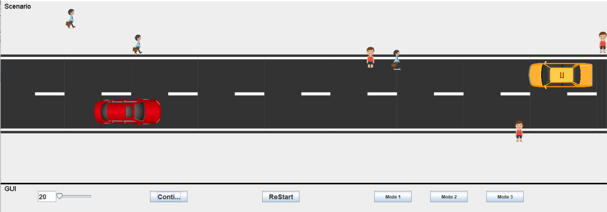

# CAV-Jason
This contains the project files for the agency-directed test generation research using the JASON platform.

The associated thesis give background into the problem of using agents to find tests using goal-directed behaviour.

The project code is designed to run multiple times and calculate efficiency of generating appropriate tests and natural behaviour of the agents through their score. The score is determined by a living cost, favouring short tests, and penalising time spent in the road.

The number of agents can be explored along with the type of behaviour where the three modes are: 1) random (walk randomly), 2) constrained random (walk along pavement and randomly cross the road) and 3) proximity (cross the road when agent is in proximity to vehicle)
